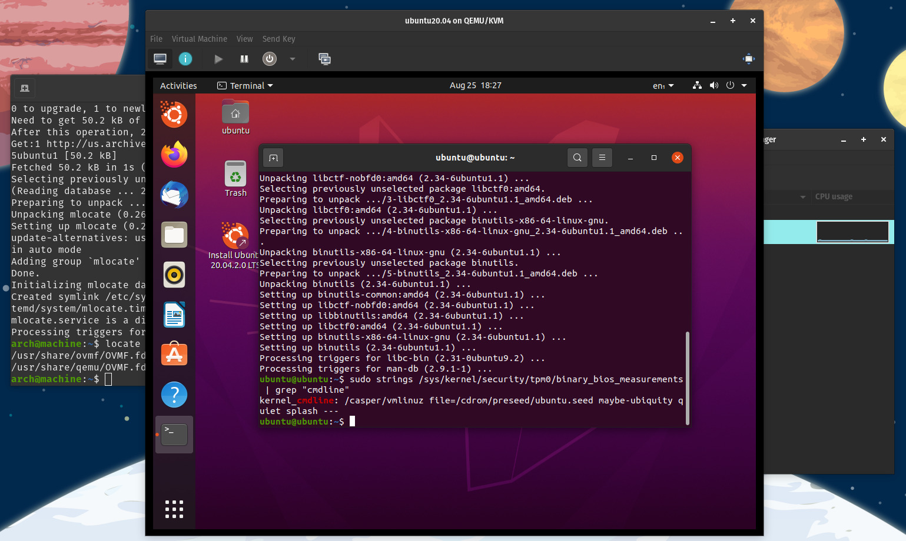

# SoftwareTPMMeasurement

Experiment on how to emulate TPM modules on virtual machines

## Steps

1. [swtpm](https://github.com/stefanberger/swtpm) depends on [libtpms](https://github.com/stefanberger/libtpms).
libtpms exists on Ubuntu repositories but latest stable version of swtpm fails to compile with the repository version.
So simply clone the [libtpms repository](https://github.com/stefanberger/libtpms) and checkout to latest stable branch:

`git clone git@github.com:stefanberger/libtpms.git`

`cd libtpms`

`git checkout stable-0.8`

2. Follow the [libtpms installation steps](https://github.com/stefanberger/libtpms/blob/stable-0.8/INSTALL) for Debian/Ubuntu.

3. Now swtpm can be built. Like libtpm, clone the [swtpm repository](https://github.com/stefanberger/swtpm)
and checkout to the latest stable branch:

`git clone git@github.com:stefanberger/swtpm.git`

`cd swtpm`

`git checkout stable-0.6`

4. Follow the [installation guide](https://github.com/stefanberger/swtpm/blob/stable-0.6/INSTALL) BUT without reinstalling
libtpms from Ubuntu repositories while installing all other dependencies. This can overwrite the compatible version which
we just compiled and installed.

5. ovmf and virt-manager can be found on Ubuntu repositories, simply install them using apt:

`sudo apt-get install virt-manager libvirt-daemon ovmf`

6. Create a virtual machine using virt-manager following [Quick Start using virt-manager](https://wiki.ubuntu.com/UEFI/OVMF)
steps

7. Head into the virtual machine properties and add [TPM device](https://en.opensuse.org/Software_TPM_Emulator_For_QEMU#Start_swtpm_with_libvirt)
to the newly created machine. For this, you may need to enable XML editing from virt-manager preferences.

8. Open the virtual machine with your favorite distribution and check if Software TPM Emulator is working as expected
with the following command:

`sudo strings /sys/kernel/security/tpm0/binary_bios_measurements | grep "cmdline"`

strings tool can be found in binutils package. If everything goes as expected, you should see an output similar to this one:

